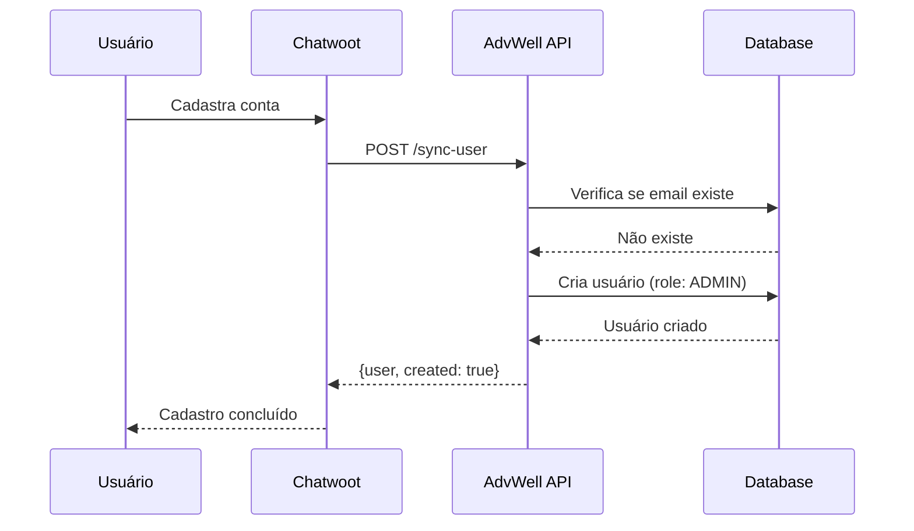
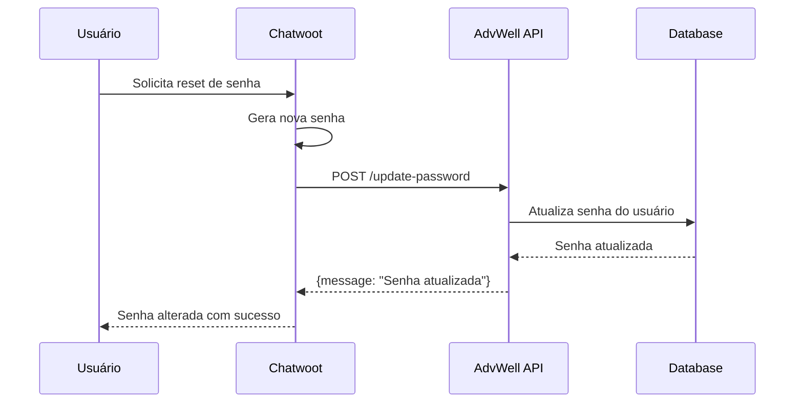
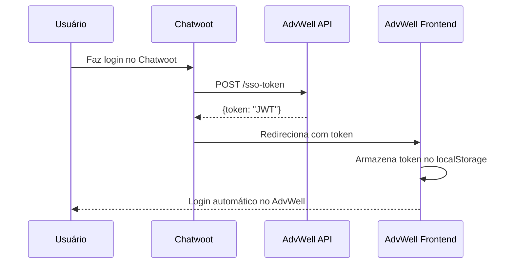

# Integração AdvWell + Chatwoot

Este documento descreve como integrar o sistema AdvWell com o Chatwoot para sincronização de usuários e Single Sign-On (SSO).

## 📋 Funcionalidades

A integração permite:

1. **Sincronização de Usuários** - Quando um usuário se cadastra no Chatwoot, ele é automaticamente criado no AdvWell com role ADMIN
2. **Sincronização de Senhas** - Quando um usuário reseta a senha no Chatwoot, a senha é atualizada no AdvWell
3. **Single Sign-On (SSO)** - Login automático no AdvWell após autenticação no Chatwoot
4. **Embedding** - O AdvWell pode ser embedado no Chatwoot via iframe

## 🔑 Configuração da API Key

### 1. Gerar API Key para uma Empresa

Primeiro, você precisa gerar uma API Key para a empresa que usará a integração:

```bash
# Conectar ao banco de dados
docker exec -it $(docker ps -q -f name=advtom_postgres) psql -U postgres -d advtom

# Gerar API Key (UUID) para uma empresa específica
UPDATE companies
SET "apiKey" = gen_random_uuid()::text
WHERE email = 'admin@suaempresa.com';

# Ver a API Key gerada
SELECT id, name, email, "apiKey" FROM companies WHERE email = 'admin@suaempresa.com';

# Sair do psql
\q
```

### 2. Guardar a API Key de Forma Segura

A API Key gerada deve ser configurada no Chatwoot como variável de ambiente ou configuração de webhook.

**Exemplo de API Key:**
```
a1b2c3d4-e5f6-7g8h-9i0j-k1l2m3n4o5p6
```

## 🔌 Endpoints da API

Todas as chamadas de API requerem o header:
```
X-API-Key: sua-api-key-aqui
```

### Base URL
```
https://api.advwell.pro/api/integration
```

---

### 1. Sincronizar Usuário

**Endpoint:** `POST /api/integration/sync-user`

**Descrição:** Cria um novo usuário no AdvWell ou atualiza se já existir.

**Headers:**
```http
Content-Type: application/json
X-API-Key: a1b2c3d4-e5f6-7g8h-9i0j-k1l2m3n4o5p6
```

**Body:**
```json
{
  "name": "João Silva",
  "email": "joao@exemplo.com",
  "password": "senha123" // Opcional - se omitido, gera automaticamente
}
```

**Resposta de Sucesso (201 - Usuário Criado):**
```json
{
  "message": "Usuário criado com sucesso",
  "user": {
    "id": "uuid-do-usuario",
    "name": "João Silva",
    "email": "joao@exemplo.com",
    "role": "ADMIN",
    "active": true,
    "createdAt": "2025-11-08T10:30:00.000Z"
  },
  "created": true,
  "temporaryPassword": "A7b!2cD9eF@3" // Apenas se password não foi fornecido
}
```

**Resposta de Sucesso (200 - Usuário Atualizado):**
```json
{
  "message": "Usuário atualizado com sucesso",
  "user": {
    "id": "uuid-do-usuario",
    "name": "João Silva",
    "email": "joao@exemplo.com",
    "role": "ADMIN",
    "active": true,
    "createdAt": "2025-11-08T10:30:00.000Z"
  },
  "created": false
}
```

**Erros:**
- `400` - Dados incompletos (name ou email faltando)
- `401` - API Key inválida ou ausente
- `409` - Email já cadastrado em outra empresa
- `500` - Erro interno do servidor

---

### 2. Atualizar Senha

**Endpoint:** `POST /api/integration/update-password`

**Descrição:** Atualiza a senha de um usuário existente.

**Headers:**
```http
Content-Type: application/json
X-API-Key: a1b2c3d4-e5f6-7g8h-9i0j-k1l2m3n4o5p6
```

**Body:**
```json
{
  "email": "joao@exemplo.com",
  "newPassword": "novaSenhaSegura123"
}
```

**Resposta de Sucesso (200):**
```json
{
  "message": "Senha atualizada com sucesso",
  "email": "joao@exemplo.com"
}
```

**Erros:**
- `400` - Dados incompletos ou senha muito curta (mínimo 6 caracteres)
- `401` - API Key inválida ou ausente
- `404` - Usuário não encontrado nesta empresa
- `500` - Erro interno do servidor

---

### 3. Gerar Token SSO

**Endpoint:** `POST /api/integration/sso-token`

**Descrição:** Gera um token JWT para login automático (Single Sign-On).

**Headers:**
```http
Content-Type: application/json
X-API-Key: a1b2c3d4-e5f6-7g8h-9i0j-k1l2m3n4o5p6
```

**Body:**
```json
{
  "email": "joao@exemplo.com"
}
```

**Resposta de Sucesso (200):**
```json
{
  "token": "eyJhbGciOiJIUzI1NiIsInR5cCI6IkpXVCJ9.eyJ1c2VySWQiOiJ1dWlkIiwiZW1haWwiOiJqb2FvQGV4ZW1wbG8uY29tIiwicm9sZSI6IkFETUlOIiwiY29tcGFueUlkIjoidXVpZCIsImlhdCI6MTYzOTQxMjQwMH0.signature",
  "user": {
    "id": "uuid-do-usuario",
    "name": "João Silva",
    "email": "joao@exemplo.com",
    "role": "ADMIN",
    "companyId": "uuid-da-empresa",
    "companyName": "Minha Empresa"
  }
}
```

**Erros:**
- `400` - Email não fornecido
- `401` - API Key inválida ou ausente
- `403` - Empresa inativa
- `404` - Usuário não encontrado ou inativo
- `500` - Erro interno do servidor

---

## 🎯 Fluxo de Integração Completo

### Cenário 1: Novo Usuário se Cadastra no Chatwoot



### Cenário 2: Usuário Reseta Senha no Chatwoot



### Cenário 3: Login com SSO



---

## 🌐 Embedding do AdvWell no Chatwoot

Para embedar o AdvWell dentro do Chatwoot, você pode usar um iframe:

### HTML do Iframe

```html
<iframe
  src="https://app.advwell.pro?sso_token=TOKEN_AQUI"
  width="100%"
  height="100%"
  frameborder="0"
  style="border: none;"
></iframe>
```

### Frontend: Receber Token SSO via URL

O frontend do AdvWell precisa verificar se há um token SSO na URL e fazer login automaticamente:

**Exemplo (JavaScript):**
```javascript
// No carregamento da página
const urlParams = new URLSearchParams(window.location.search);
const ssoToken = urlParams.get('sso_token');

if (ssoToken) {
  // Armazena o token
  localStorage.setItem('token', ssoToken);

  // Redireciona para home ou recarrega
  window.location.href = '/';
}
```

---

## 🔐 Segurança

### Proteção da API Key

1. **Nunca exponha a API Key no código frontend**
2. **Use HTTPS** para todas as chamadas (já configurado)
3. **Armazene a API Key em variável de ambiente** no Chatwoot
4. **Rotacione a API Key periodicamente**

### Rotação de API Key

```sql
-- Gerar nova API Key
UPDATE companies
SET "apiKey" = gen_random_uuid()::text
WHERE id = 'company-uuid';

-- Ver nova chave
SELECT "apiKey" FROM companies WHERE id = 'company-uuid';
```

### Rate Limiting

O AdvWell possui rate limiting global de **100 requisições por 15 minutos por IP**.

---

## 🧪 Testes

### Teste Manual com cURL

#### 1. Criar Usuário
```bash
curl -X POST https://api.advwell.pro/api/integration/sync-user \
  -H "Content-Type: application/json" \
  -H "X-API-Key: sua-api-key-aqui" \
  -d '{
    "name": "Teste Usuario",
    "email": "teste@exemplo.com",
    "password": "senha123"
  }'
```

#### 2. Atualizar Senha
```bash
curl -X POST https://api.advwell.pro/api/integration/update-password \
  -H "Content-Type: application/json" \
  -H "X-API-Key: sua-api-key-aqui" \
  -d '{
    "email": "teste@exemplo.com",
    "newPassword": "novaSenha456"
  }'
```

#### 3. Gerar Token SSO
```bash
curl -X POST https://api.advwell.pro/api/integration/sso-token \
  -H "Content-Type: application/json" \
  -H "X-API-Key: sua-api-key-aqui" \
  -d '{
    "email": "teste@exemplo.com"
  }'
```

---

## 📞 Suporte

Para dúvidas ou problemas com a integração:

1. Verifique os logs do backend: `docker service logs advtom_backend -f`
2. Confirme que a API Key está correta
3. Verifique se a empresa está ativa no banco de dados
4. Confirme que o email do usuário existe e está correto

---

## 🚀 Próximos Passos

1. **Aplicar a migration:**
   ```bash
   docker exec -it $(docker ps -q -f name=advtom_backend) sh
   psql $DATABASE_URL < /app/migrations_manual/add_api_key_to_companies.sql
   ```

2. **Gerar API Key para sua empresa**

3. **Configurar webhooks no Chatwoot**

4. **Testar os endpoints** com cURL ou Postman

5. **Implementar o iframe** no Chatwoot

6. **Configurar SSO automático** no frontend do AdvWell
